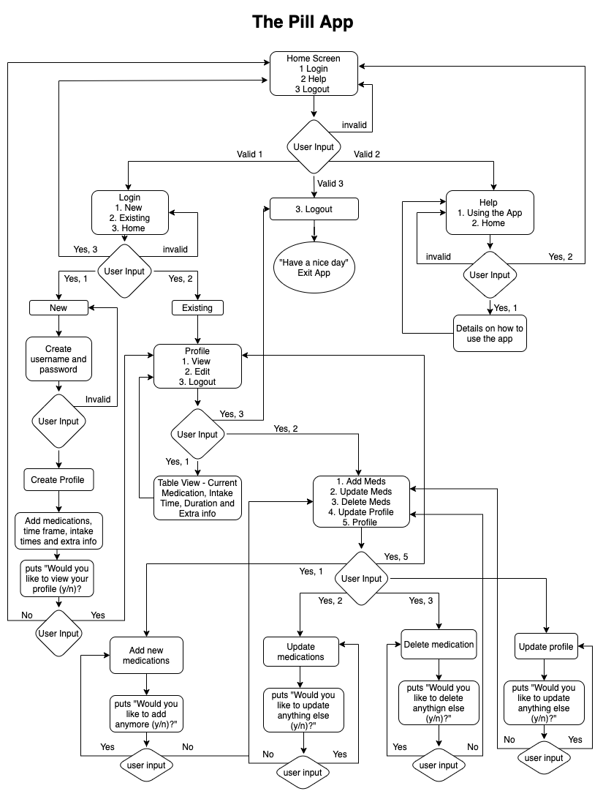

# Software Development Plan #

#### 1. Source Control Repository ####

Git Repo - https://github.com/pratibhars/T1A3.git

#### 2. Purpose and Scope ####

**Pill App (better name tba)**

The Pill Box is designed for individuals who have to take medications at set times. There are multiple medications that a person might need to take based on their situation. It could be someone who is recovering from their sickness, chronic illness, they are older and generally on multiple medications or a regular person who's keen on taking supplements such as vitamins but finds it's hard to remember when to take their medications. The application could also be used by parents for their kids, caregivers or pet owners.

The application would look at solving this problem by giving them a terminal app into which they can enter the medication they’d need to take and when they’d need to take it and how long they’d need the to take it for and if the medication is to be taken, before food, after food. They can then add and delete and update this list when things changes. The application would then send them a email reminder on the day the pill needs to be taken.

Each person would have the ability to create their own profiles, this includes their full name, email and an askii art for their profile. They can then specify medication lists, times and other requirements and amend these as required. 

#### 3. Features ####

1. **Login/Home Menu** 

    The pill app aims to make the home screen easy to use. The initial display will include logo and will have four options for users to access. 
       1. Login - where the user can login to the application or create a new login for the application
       2. Help - the help bar will give them information on how to use the app
       3. Profile - the profile menu will give you the ability to view your list of medications, add to them, update them, update your profile.
       4. Logout - which will help them close the application and exit.

2. **Create Profile**
   
   The pill app creates a profile which holds the information in JSON. The information for the profile includes adding medications, intake time, duration and extra information around the pill i.e. before/after food

3. **Add/Update/Delete Medicine**
    
    Following the CRUD methodology, the applications allows you to add medications, update exisiting medications and delete the medications. 

4. **Update Profile**

    The app provides the ability to update password and email as well

5. **Email Notification**

    The app has the ability to send through email notifications to remind the users to take their pills.

#### 4. Outline ####

- The user can use the help menu or alternatively can run the program ```ruby main.rb - h``` to read through the menu. 
- The pill box uses tty-prompt.select to create an easy navigation menu with prompts on screen on how to move along the menu. 
- The user can either click into the menu option using enter or by pressing the number that is present next to the option
- My application will have a lot of user-input error, i have used tty.prompt.ask to eliminate a lot of error around not having any input from the user or having inputs left blank, by making sure they are required functions, the other errors would be around the JSON file and data not being stored in there for this I have used the rescue error - Errno::ENOENT. 

#### 5. Control Flow ####


#### 6. Implementation Plan ####

<https://trello.com/b/CZU9UUuP/terminal-appt1a3>

